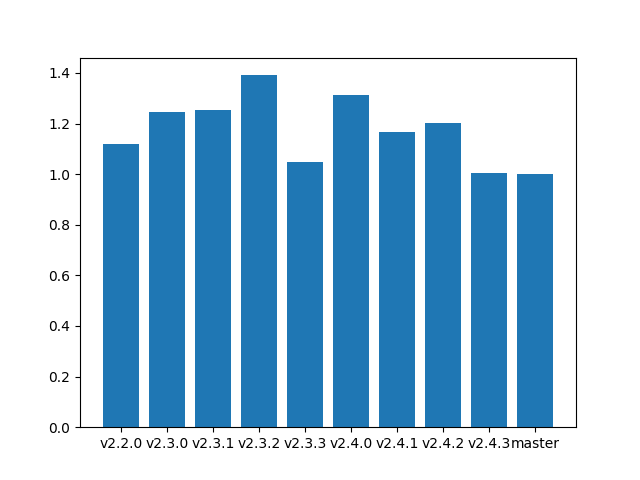
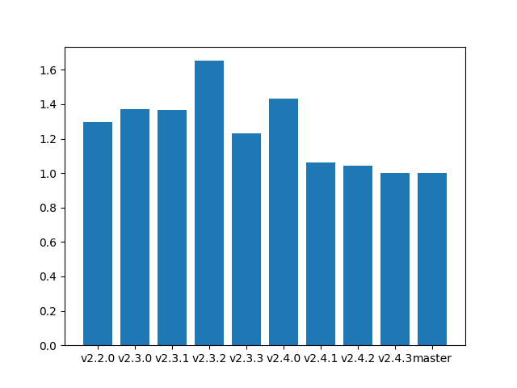
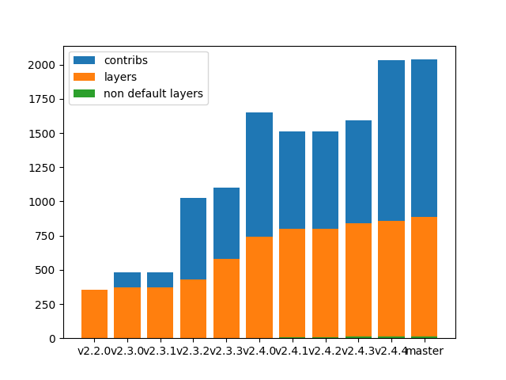
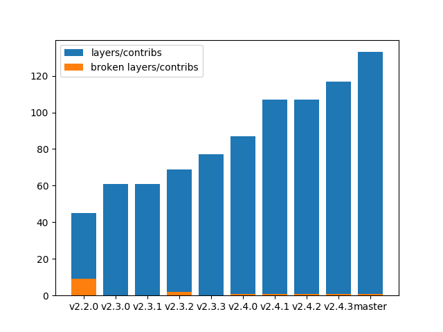

# scapy-benchmarks

### Dissection (IP+UDP+DNS) time


*Values are displayed RELATIVELY to the most recent mesure (the one on the right will always be 1.0)*

### Build (IP+UDP+DNS) time


*Values are displayed RELATIVELY to the most recent mesure (the one on the right will always be 1.0)*

### Number of packet definitions



### Number of contrib layers files



### Infos

Host machine:
```
2.7.17 (default, Nov  7 2019, 10:07:09) 
[GCC 7.4.0]
```

Current master: [`7de7a07`](https://github.com/secdev/scapy/commit/7de7a0794dd07b8cca321ec87db866a86999fb06)
