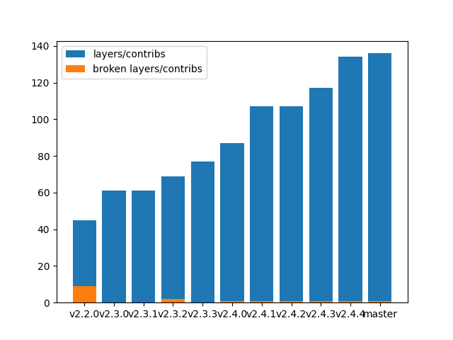

# scapy-benchmarks

### Dissection (IP+UDP+DNS) time


### Build (IP+UDP+DNS) time

*Values are displayed RELATIVELY to the most recent mesure (the one on the right will always be 1.0)*


### Number of packet definitions

*Values are displayed RELATIVELY to the most recent mesure (the one on the right will always be 1.0)*


### Number of contrib layers files



### Infos

Host machine:
```
2.7.17 (default, Nov  7 2019, 10:07:09) 
[GCC 7.4.0]
```

Current master: [`6c331b7`](https://github.com/secdev/scapy/commit/6c331b78aaeef7af53035760698b1d7d6afeb9a7)
