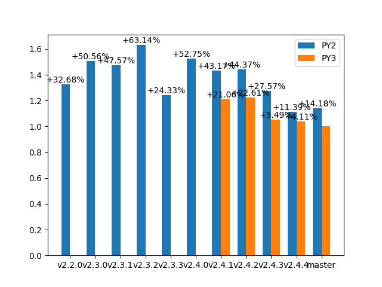

# scapy-benchmarks

### Dissection (IP+UDP+DNS) time



<sup><sub>*Values are displayed RELATIVELY to the most recent mesure (the one on the right will always be 1.0)*</sub></sup>

### Build (IP+UDP+DNS) time


<sup><sub>*Values are displayed RELATIVELY to the most recent mesure (the one on the right will always be 1.0)*</sub></sup>

### Number of packet definitions


### Number of contrib layers files


### Infos

Host machine:
```
2.7.17 (default, Nov  7 2019, 10:07:09) 
[GCC 7.4.0]
```

Current master: [`3047580`](https://github.com/secdev/scapy/commit/3047580162a9407ef05fe981983cacfa698f1159)
